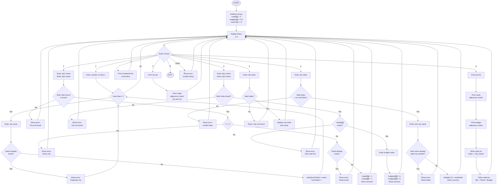

```mermaid
flowchart TD
    START([START]) --> INIT["Initialize arrays\nroads[][] = 0\nbudgets[][] = 0.0\nnumCities = 0"]
    INIT --> MENU["Display Menu\n1-9"]
    MENU --> CHK{"Enter Choice"}

    %% ── MENU 1: Add Cities ──────────────────────────────────
    CHK -->|"1"| M1_N["Enter number of cities n"]
    M1_N --> M1_LOOP{"i less than n ?"}
    M1_LOOP -->|"Yes"| M1_INPUT["Enter city name"]
    M1_INPUT --> M1_DUP{"Name already\nexists?"}
    M1_DUP -->|"Yes"| M1_SKIP["Show error:\nDuplicate city"] --> M1_LOOP
    M1_DUP -->|"No"| M1_ADD["cities[numCities] = name\nnumCities++"] --> M1_LOOP
    M1_LOOP -->|"No"| MENU

    %% ── MENU 2: Add Road ────────────────────────────────────
    CHK -->|"2"| M2_INPUT["Enter city1 name\nEnter city2 name"]
    M2_INPUT --> M2_FOUND{"Both cities found\nin array?"}
    M2_FOUND -->|"No"| M2_ERR["Show error:\nCity not found"] --> MENU
    M2_FOUND -->|"Yes"| M2_SAME{"i == j ?"}
    M2_SAME -->|"Yes"| M2_ERR2["Show error:\nSame city"] --> MENU
    M2_SAME -->|"No"| M2_EXISTS{"Road already\nexists?"}
    M2_EXISTS -->|"Yes"| M2_ERR3["Show error:\nRoad exists"] --> MENU
    M2_EXISTS -->|"No"| M2_ADD["roads[i][j] = 1\nroads[j][i] = 1\nShow success"] --> MENU

    %% ── MENU 3: Add Budget ──────────────────────────────────
    CHK -->|"3"| M3_INPUT["Enter city1 name\nEnter city2 name"]
    M3_INPUT --> M3_FOUND{"Both cities found?"}
    M3_FOUND -->|"No"| M3_ERR["Show error:\nCity not found"] --> MENU
    M3_FOUND -->|"Yes"| M3_ROAD{"roads[i][j]\nexists?"}
    M3_ROAD -->|"No"| M3_ERR2["Show error:\nAdd road first"] --> MENU
    M3_ROAD -->|"Yes"| M3_B["Enter budget value"]
    M3_B --> M3_ADD["budgets[i][j] = b\nbudgets[j][i] = b\nShow success"] --> MENU

    %% ── MENU 4: Edit City ───────────────────────────────────
    CHK -->|"4"| M4_IDX["Enter city index"]
    M4_IDX --> M4_VALID{"Valid index\n1 to numCities?"}
    M4_VALID -->|"No"| M4_ERR["Show error:\nInvalid index"] --> MENU
    M4_VALID -->|"Yes"| M4_NAME["Enter new city name"]
    M4_NAME --> M4_TAKEN{"New name already\ntaken by another?"}
    M4_TAKEN -->|"Yes"| M4_ERR2["Show error:\nName taken"] --> MENU
    M4_TAKEN -->|"No"| M4_UPDATE["cities[idx-1] = newName\nShow success"] --> MENU

    %% ── MENU 5: Search City ─────────────────────────────────
    CHK -->|"5"| M5_IDX["Enter city index"]
    M5_IDX --> M5_VALID{"Valid index?"}
    M5_VALID -->|"No"| M5_NOT["Show: City not found"] --> MENU
    M5_VALID -->|"Yes"| M5_SHOW["Display city index\nand name"] --> MENU

    %% ── MENU 6: Display Cities ──────────────────────────────
    CHK -->|"6"| M6["Print numbered list\nof all cities"] --> MENU

    %% ── MENU 7: Display Roads ───────────────────────────────
    CHK -->|"7"| M7A["Print city list"]
    M7A --> M7B["Print roads\nadjacency matrix\n(0s and 1s)"] --> MENU

    %% ── MENU 8: Display All + Save ──────────────────────────
    CHK -->|"8"| M8A["Print city list"]
    M8A --> M8B["Print roads\nadjacency matrix"]
    M8B --> M8C["Print budget\nadjacency matrix"]
    M8C --> M8D["Write cities.txt\nIndex + City_Name"]
    M8D --> M8E["Write roads.txt\nNbr + Road + Budget"] --> MENU

    %% ── MENU 9: Exit ────────────────────────────────────────
    CHK -->|"9"| STOP(["EXIT"])

    %% ── Invalid ─────────────────────────────────────────────
    CHK -->|"Other"| INV["Show error:\nInvalid choice"] --> MENU
```
